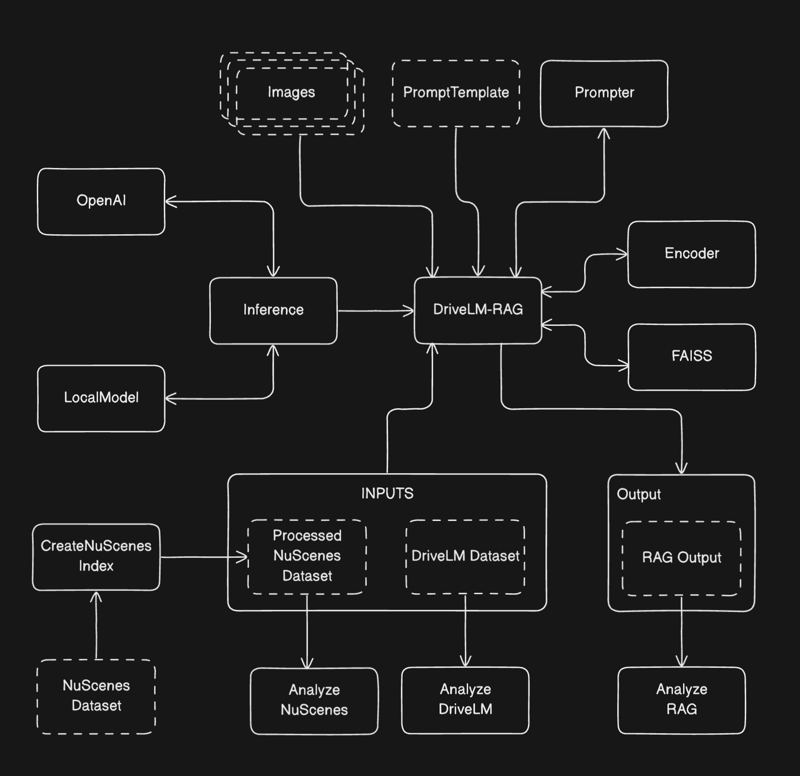

# DriveLM RAG — NuScenes + Vision-Language QA

A Retrieval-Augmented Generation (RAG) pipeline that:
- builds a searchable **NuScenes** image index,
- retrieves the most relevant frames for a **DriveLM** question,
- constructs a **multimodal** prompt (metadata + retrieved images),
- answers with either **OpenAI** models or a **local** VLM (**Qwen2.5-VL**),
- persists outputs for later analysis.

---

## Architecture



## Contents
- Features
- Repository Layout
- Requirements
- Installation
- Data Setup
- Prompt Template
- Environment
- Quick Start
- Programmatic Usage
- Analysis Utilities
- Implementation Notes
- Troubleshooting
- License

---

## Features
- **Indexing**: Extracts ego pose, speed (m/s), and per-frame object counts from NuScenes mini and writes a compact JSON index.
- **Embedding**: CLIP encoders for images/text; vectors are L2-normalized.
- **Retrieval**: FAISS Inner-Product over normalized vectors (equivalent to cosine).
- **Generation**:
  - **Remote**: OpenAI Responses API.
  - **Local**: Qwen2.5-VL-7B-Instruct with 4-/8-bit loading (bitsandbytes, GPU).
- **Prompting**: YAML-driven system prompt; combines text metadata + base64 images.
- **Analysis**: Plot distributions and render retrieved frames with metadata.

---

## Repository Layout
```
resources/
  data/
    drivelm/
    nuscenes-mini/v1.0-mini/
  output/
    nuscenes_processed.json
    drive_lm_with_lm_outputs.pkl/json
    per_scene_lm_analysis_qustion.json
  prompt_template.yaml 

src/
  encoders/
    encoder.py                        # EncodeImageText (CLIP)
    faiss.py                          # FaissDB
  inference/
    open_ai_inference.py              # OpenAICaller
    local_lm_inference.py             # LocalInference (Qwen2.5-VL)
    inference.py                      # Inference router
  util/
    prompter.py                       # Prompter (builds chat messages)
    load_file.py                      # FileLoader
    data_types.py                     # ModelType, ErrorTypes
preprocess/
    create_nuscenes_index.py          # CreateNuscenesIndex entrypoint
analysis/
  drive_lm_analysis.py                # DriveLMAnalysis
  analyze_nuscenes.py                 # AnalyzeNuscenes
  analyze_rag.py                      # AnalyzeRag

lm_rag.py                             # LMRag entrypoint (end-to-end RAG)

```

---

## Requirements
- **Python** ≥ 3.10
- **GPU (CUDA)** required for local Qwen inference (`.to("cuda")` in code).
- **NuScenes mini** dataset under `resources/data/nuscenes-mini/v1.0-mini/`.

### Python packages

- **Poetry** : This repo uses Poetry for easy setup. Simply run `source setup.sh` from the root directory to setup environemt. Since this solution was run on Colab for the local Inference, additional packages might be required (GPU specific). Kindly take note of this before running.

A good rule of thumb might be to add the following : 

```bash

poetry add numpy pillow faiss-cpu matplotlib ipython python-dotenv pyyaml

poetry add torch --index-url https://download.pytorch.org/whl/cu121 

poetry add transformers

poetry add "openai>=1.40.0"

poetry add qwen-vl-utils bitsandbytes
```


---

## Data Setup

### 1) NuScenes mini
Place the official mini split JSON and images:
```
resources/data/nuscenes-mini/v1.0-mini/
  category.json
  ego_pose.json
  instance.json
  sample.json
  sample_data.json
  sample_annotation.json
  samples/CAM_.../*.jpg
  ...
```

### 2) DriveLM
Provide a DriveLM train JSON, e.g. `resources/data/drivelm/train_sample.json`.

Schema (fragment):
```json
{
  "scene_id": {
    "scene_description": "...",
    "key_frames": {
      "frame_id": {
        "QA": {
          "perception": [{"Q": "...", "A": "..."}],
          "prediction":  [...],
          "planning":    [...],
          "behavior":    [...]
        }
      }
    }
  }
}
```
---

## Prompt Template
`resources/prompt_template.yaml` must include key `rag.system`.

Example:
```yaml
rag:
  system: |
    You are a driving scene assistant. Reason over images and provided metadata.
    Be concise, state assumptions, and cite evidence from retrieved frames.
```

The user message is assembled from a sequence of items:
- `{"type":"text", "item":"...metadata..."}`
- `{"type":"image","item":"<base64 JPEG>"}`
- final text item with the query

`Prompter` converts message parts for local Qwen format automatically when `local_inference=True`.

---

## Environment
Set your OpenAI API key for remote inference:
```bash
export OPENAI_API_KEY="sk-..."
```

---

## Quick Start

### A) Build the NuScenes index
Creates `resources/output/nusciences_processed.json` with ego pose, speed, objects, and image rel paths.
```bash
python create_nuscenes_index.py
```

### B) Run end-to-end RAG
Encodes all frames with CLIP, builds FAISS, retrieves per DriveLM question, calls the model, and writes outputs to `resources/output/drive_lm_with_lm_outputs.json`.
```bash
python lm_rag.py
```

Defaults (`LMRag.__init__`):
- DriveLM: `resources/data/drivelm/train_sample.json`
- NuScenes index: `resources/output/nusciences_processed.json`
- Prompt: `resources/prompt_template.yaml`
- Inference: **OpenAI** (set `local_inference=False`)

#### Use local Qwen (GPU)
In your runner (e.g., `lm_rag.py`):
```python
from lm_rag import LMRag
lm_rag = LMRag(local_inference=True)
lm_rag.perform_rag()
```

---

## Programmatic Usage

### OpenAI caller
```python
from src.inference.open_ai_inference import OpenAICaller

messages = [{
  "role": "user",
  "content": [
    {"type": "input_text", "text": "What is going on here?"},
    {"type": "input_image", "image_url": "data:image/jpeg;base64,<...>"}
  ],
}]
resp = OpenAICaller().generate_response(messages)
print(resp)
```

### Local Qwen caller
```python
from src.inference.local_lm_inference import LocalInference

messages = [{
  "role": "user",
  "content": [
    {"type": "text", "text": "What is going on here?"},
    {"type": "image", "image": "data:image/jpeg;base64,<...>"}
  ],
}]
resp = LocalInference().generate_response(messages)
print(resp)
```

---


## Implementation Notes
- **Cosine similarity** via FAISS IP over L2-normalized embeddings.
- **EncodeImageText** accepts file paths or `PIL.Image.Image`. Text encoding truncates at CLIP max length.
- **LocalInference** loads `Qwen/Qwen2.5-VL-7B-Instruct`; quantization optional via bitsandbytes.

---

## Troubleshooting
- **FAISS import errors**: use `faiss-cpu` (or `faiss-gpu` for CUDA).
- **CUDA / OOM (local Qwen)**: ensure a CUDA-enabled GPU; try `load_in_8bit=True` or `load_in_4bit=True`.
- **OpenAI errors**: rate limits/API errors surface as `ValueError`; verify `OPENAI_API_KEY` and model name.
- **Path issues**: adjust constructor args or data locations if your structure differs.

---

## License
MIT License.